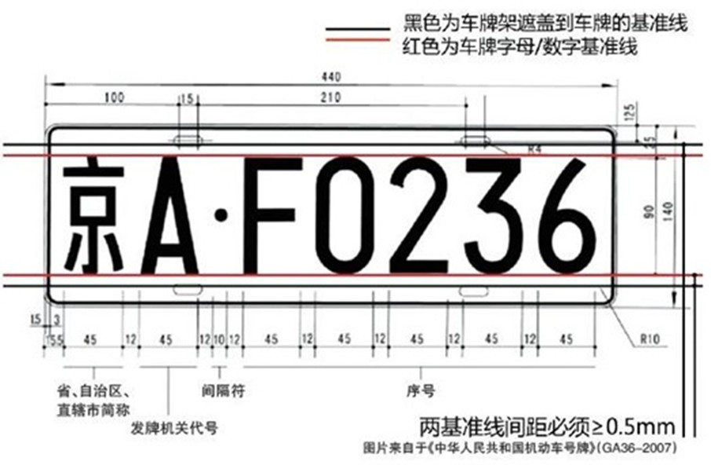
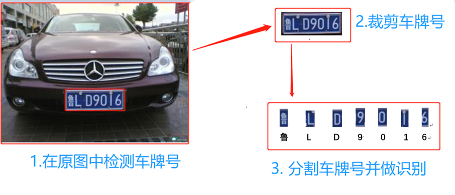
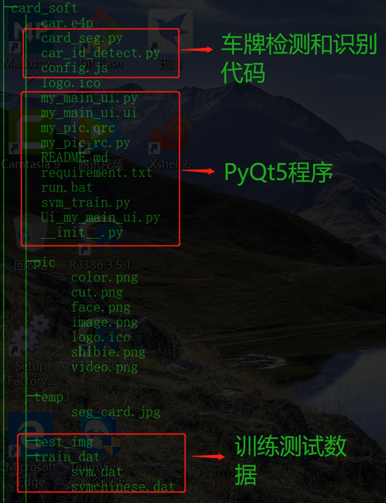
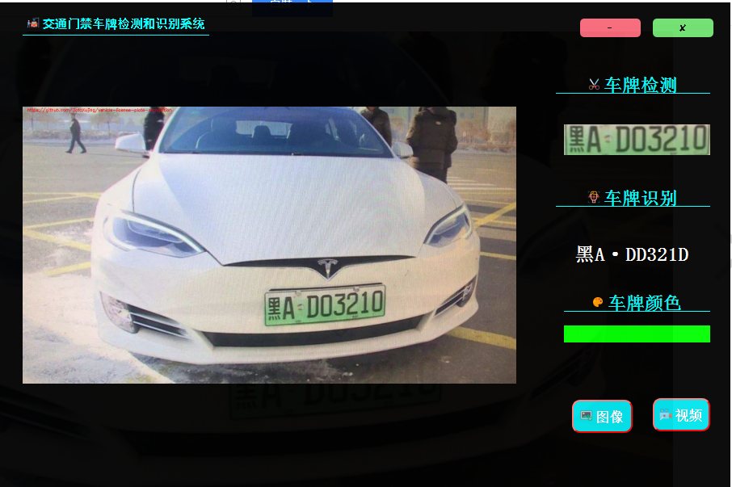

# 车牌检测和识别的Python应用软件实现

徐静 

## 1.车牌检测和识别项目介绍

*图片来源：https://www.cnblogs.com/polly333/p/7367479.html*

车牌的检测和识别的应用非常广泛，比如交通违章车牌追踪，小区或地下车库门禁。在对车牌识别和检测的过程中，因为车牌往往是规整的矩形，长宽比相对固定，色调纹理相对固定，常用的方法有：基于形状、基于色调、基于纹理、基于文字特征等方法，近年来随着深度学习的发展也会使用目标检测的一些深度学习方法。该项目主要的流程如下图所示：

1.输入原始图片，通过二值化，边缘检测，和基于色调的颜色微调等办法检测出原图中的车牌号的位置；

2.把检测到的车牌(ROI)裁剪，为车牌号的识别做准备；

3.基于裁剪的车牌号，使用直方图的波峰波谷分割裁剪的车牌号（如上图中的第3步）

4.训练机器学习模型做车牌识别，这里训练了2个SVM,一个SVM用来识别省份简称(如 鲁)，另一个SVM用来识别字母和数字。

5.通过PyQt5把整个算法封装成GUI程序，并打包发布安装软件。

## 2.项目代码解析
下图描述了整个项目的代码结构，可以访问https://github.com/DataXujing/vehicle-license-plate-recognition 查看，其结构如下：

## 3.项目演示

可以通过访问项目地址 ( https://github.com/DataXujing/vehicle-license-plate-recognition ）查看整个应用,或者访问安装程序下载地址 （https://pan.baidu.com/s/1IazbGFLlQkb8BQmK_EAeRA  提取码：v103 ）安装安装程序进行测试，这里展示一些识别结果和测试视频：

<video src="./pic/demo.mp4" controls="controls" ></video>

## 4.TODO

目前识别的效果针对于某些场景下仍然很不理想，技术层面上的主要原因有两个，一个是车牌检测算法并没有检测到车牌（这主要是检测算法的问题），可以尝试一些目标检测的算法，比如Faster R-CNN(速度可能慢一些)，YOLO系列, SSD系列等的经典的目标检测算法，然后做矫正或进一步的区域筛选；另一个原因是是在识别算法上，本次我们仅是基于少量的训练数据训练了SVM，可以尝试增加训练集并把模型替换成一些更复杂的机器学习模型如XGBoost,LightGBM,CatBoost等模型或使用CNN训练一个多分类的深度学习模型， 亦或者是直接考虑一些基于Attention的CNN-RNN架构的OCR识别模型。

## Reference

1.[OpenCV图像识别：车牌定位算法源码，Python语言实现](https://blog.csdn.net/sumkee911/article/details/79435983)

2.[车牌号识别 python + opencv](https://blog.csdn.net/wzh191920/article/details/79589506)

3 [License-Plate-Recognition](https://github.com/wzh191920/License-Plate-Recognition)

4.[车牌识别（一）-车牌定位](https://www.cnblogs.com/polly333/p/7367479.html)

5.[在PyQt5中美化和装扮图形界面](https://zmister.com/archives/477.html)
